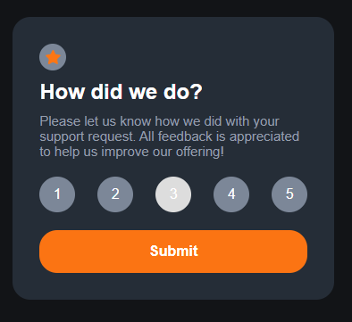
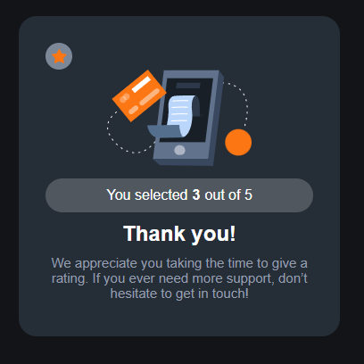

# Interactive Rating Component

This project is a simple web application that allows users to provide a rating from 1 to 5 and then thanks them for their feedback. The project is built using HTML, CSS, and JavaScript.

## Features

- Users can select a rating between 1 and 5.
- Once a rating is selected, users can submit their rating by clicking the "Submit" button.
- After submitting, users see a "Thank You" message along with the rating they gave.
- The rating buttons change appearance when selected.
- Smooth transition animation when moving from the rating to the thank you state.

## Getting Started

### Prerequisites

- A web browser (e.g. Chrome, Firefox, Safari)

### Running the project

1. Clone the repository to your local machine.

2. Open the `index.html` file in your web browser.

## Built With

- HTML
- CSS
- JavaScript

## Contributing

This project is for educational purposes and not open for contributions.

## Acknowledgments

This project is based on a challenge by [Frontend Mentor](https://www.frontendmentor.io).

## License

This project is licensed under the MIT License.

